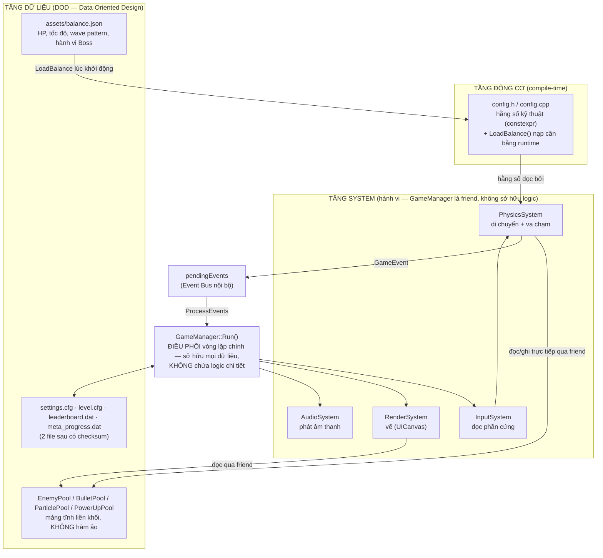
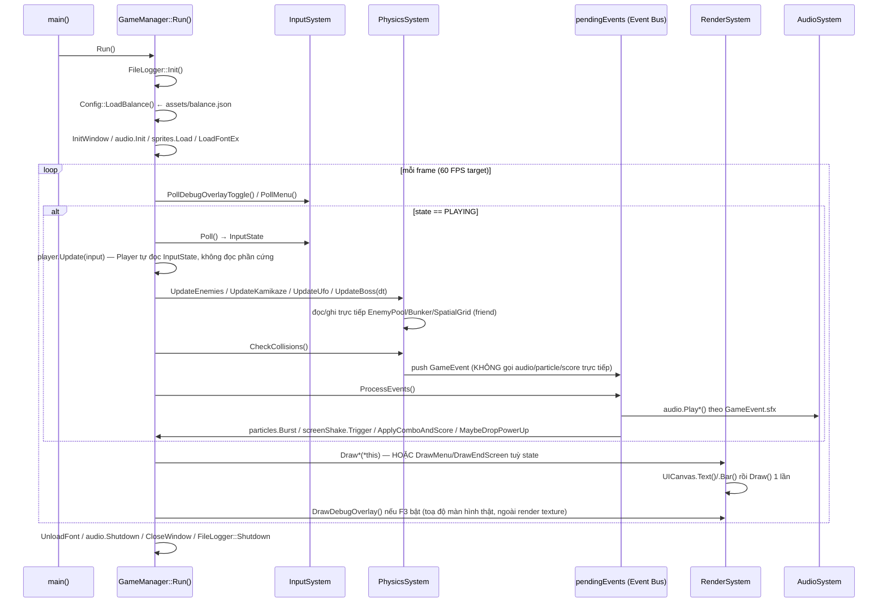
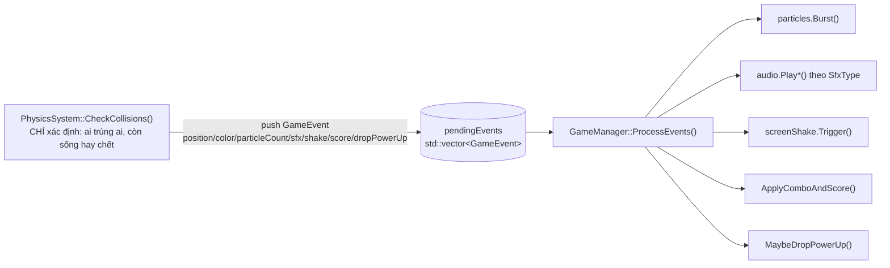

# Kiến trúc kỹ thuật — Hardcore Space Invaders

Tài liệu này là **bản đồ** cho bất kỳ ai (kể cả chính bạn 6 tháng sau) cần biết
"sửa cái này thì phải đụng vào đâu" mà không phải đọc lại toàn bộ `src/`. Nó mô
tả các module giao tiếp với nhau **thế nào**, không lặp lại **tại sao** từng
dòng code được viết như vậy — lý do chi tiết nằm trong comment tại chỗ.

> Sơ đồ dùng cú pháp [Mermaid](https://mermaid.js.org/) — GitHub render trực
> tiếp trong trình xem file, không cần công cụ ngoài.

## 1. Tổng quan 3 tầng

**Nguyên tắc phân tầng:** tầng dưới không bao giờ biết tầng trên tồn tại.
`Pools` không biết `PhysicsSystem`; `config.h` không biết `GameManager`.
Ngược lại thì có — `PhysicsSystem`/`RenderSystem` là `friend class` của
`GameManager` (xem `game_manager.h`) nên đọc/ghi thẳng dữ liệu thế giới mà
không cần một lớp getter/setter dày cộp chỉ tồn tại để "đúng OOP hình thức".
Cùng lý do đó, `GameManager` còn khai báo thêm 1 friend thứ 3 —
`GameManagerTestAccess` — nhưng đây KHÔNG phải hệ thống runtime nên không có
mặt trong sơ đồ trên: nó chỉ tồn tại trong target `unit_tests`, phục vụ đúng
2 file test (xem §7).

## 2. Vì sao DOD, không phải EnTT/ECS "thật"

Dự án **cố tình chọn DOD (Data-Oriented Design) thủ công thay vì nhúng một thư
viện ECS như EnTT.** Đây là quyết định có chủ đích, không phải làm biếng — lý
do:

- Quy mô game (vài loại địch, 1 Player, 1 Boss) không cần Entity ID động,
  Component Registry, hay View/Group query như EnTT giải quyết cho hàng vạn
  entity dị dạng. Nhúng EnTT vào đây là dùng dao mổ trâu giết gà — thêm 1 tầng
  gián tiếp (registry lookup, type-erased storage) mà không đổi lấy được lợi
  ích thực (không có nhu cầu tạo/xoá entity với component-set thay đổi động).
- Rewrite toàn bộ entity storage sang EnTT là thay đổi kiến trúc lớn, rủi ro
  cao cho một dự án nhỏ đã được tối ưu kỹ theo hướng khác — vi phạm chính
  nguyên tắc "tối ưu từ lúc project còn nhỏ, không được sai vặt" đã theo xuyên
  suốt các phase trước.

**Quy tắc DOD ĐANG được tuân thủ nghiêm ngặt** (không phải khẩu hiệu suông):

| Quy tắc | Thực thi ở đâu |
|---|---|
| Không có `virtual`/vtable ở bất kỳ đâu trong hot path | Toàn bộ `enemy_types.h`, `bullet_pool.h`, `particle_pool.h` |
| Component "swarm" (N-nhiều thực thể đồng dạng) là **struct dữ liệu thuần**, không mang hành vi | `BasicEnemy`/`TankyEnemy`/`ZigzagEnemy`/`KamikazeEnemy`/`Boss` — **không** có hàm `Update()` nào (xem §4) |
| System (không phải instance) sở hữu vòng lặp đọc/ghi component | `PhysicsSystem::UpdateEnemies/UpdateKamikaze/UpdateBoss/CheckCollisions` là nơi DUY NHẤT thay đổi dữ liệu Enemy mỗi frame |
| Mảng tĩnh liền khối, cấp phát 1 lần | `EnemyPool<T, Capacity>` dùng `T items[Capacity]` trên stack — không `std::vector<unique_ptr<T>>`, không phân mảnh heap |
| Xoá phần tử O(1), không để lại "xác chết" | Swap-and-pop (`EnemyPool::Destroy`) — biên `[0, count)` LÀ định nghĩa duy nhất của "còn sống", không có cờ `active` |
| Truy vấn không gian tránh O(N×M) | `SpatialGrid` — mỗi loại địch 1 grid riêng, value là index thuần vào đúng pool |

**Ngoại lệ có chủ đích** (không vi phạm nguyên tắc, chỉ khác phạm vi áp dụng):
`Bullet`/`Particle`/`Bunker`/`Player` vẫn giữ vài hàm thành viên non-virtual
(`Update()`, `GetSweptRect()`...) vì đây là **container/singleton tự quản lý
bất biến nội bộ** (vd `Bullet` cần `prevPos` để tính CCD, `Bunker` cần mảng
`damagedVoxels` luôn khớp với voxel grid) — không phải "component swarm" mà
System lặp qua hàng loạt bản sao dị dạng. Hàm non-virtual, không có heap
indirection, compiler inline được ở `-O2` — hiệu năng tương đương DOD thuần,
chỉ khác ở chỗ tổ chức code cho dễ đọc. Ranh giới rõ ràng: **nếu 1 kiểu dữ
liệu sống trong `EnemyPool<T,N>` và bị `PhysicsSystem` lặp qua mỗi frame, nó
phải là struct thuần — không có ngoại lệ.**

## 3. Vòng lặp chính (Main Loop) — `GameManager::Run()`

**Điểm mấu chốt:** `GameManager::UpdatePlaying()` (thân vòng lặp lúc PLAYING)
chỉ còn là **một chuỗi lời gọi tuần tự** — không phép tính hình học, không phép
so va chạm, không lệnh vẽ nào nằm trực tiếp trong đó. Đọc hàm này là đọc được
toàn bộ "chuyện gì xảy ra mỗi frame" ở mức cao, còn "xảy ra NHƯ THẾ NÀO" thì
lần theo tên hàm sang đúng System tương ứng.

## 4. Event Bus (`pendingEvents` / `GameEvent`)

Đây là cơ chế giao tiếp **PhysicsSystem → phần còn lại của game** — thay vì
`CheckCollisions()` gọi thẳng `audio.PlayExplosion()`/`particles.Burst()`/
`ApplyComboAndScore()` ngay tại chỗ phát hiện va chạm (trộn "phát hiện" với
"phản ứng" vào cùng 1 hàm khổng lồ), nó chỉ **mô tả chuyện gì vừa xảy ra**
bằng 1 `GameEvent` rồi đẩy vào hàng đợi `GameManager::pendingEvents`
(`events.h`). `GameManager::ProcessEvents()` — chạy NGAY SAU TRONG CÙNG FRAME
— duyệt hàng đợi và thực thi mọi hệ quả (âm thanh, particle, rung màn hình,
điểm, rớt power-up) một cách đồng nhất.

**Điểm xả DUY NHẤT là cuối `ProcessEvents()`.** Đây từng là một cái bẫy thật:
`CheckCollisions()` trước đây `.clear()` hàng đợi ngay ở đầu hàm, dựa trên giả
định "chỉ mình nó sinh event". Sai — `UpdateKamikaze()` chạy TRƯỚC nó trong
cùng frame và cũng đẩy event vào (nổ + sfx + rung khi Kamikaze lao trúng
player), nên toàn bộ số đó bị nuốt: người chơi mất 1 mạng mà màn hình im lặng
hoàn toàn. Quy tắc hiện tại: **ai chạy trước `ProcessEvents()` trong frame đều
được quyền ghi vào hàng đợi; không ai được clear nó ngoài `ProcessEvents()`.**

`ProcessEvents()` duyệt bằng **index + bản sao**, không phải range-for: thân
vòng lặp có thể làm dài thêm chính hàng đợi đang duyệt (`ApplyComboAndScore()`
đẩy thêm event "+1 mạng" khi vượt mốc `EXTRA_LIFE_SCORE_THRESHOLD`). Range-for
ở đó là heap-use-after-free thật sự, đã bắt được bằng AddressSanitizer.

**Vì sao KHÔNG dùng hàng đợi đa-frame (deferred sang frame sau)?** Cố ý —
`ProcessEvents()` chạy mỗi frame ngay sau `CheckCollisions()` và xả sạch, nên
hàng đợi luôn rỗng khi frame mới bắt đầu. Đây không phải một message bus
tổng quát (publish/subscribe với nhiều listener đăng ký động) — nó là 1 buffer
tái sử dụng (tránh cấp phát lại `std::vector` mỗi frame) để **tách bạch 2 mối
quan tâm** (phát hiện vs phản ứng) mà vẫn giữ độ trễ bằng 0. Nếu sau này cần
hệ quả xuyên-frame thật sự (vd hiệu ứng trì hoãn 2 giây), đó là lúc cân nhắc
nâng cấp thành hàng đợi có timestamp — chưa cần ở quy mô hiện tại.

## 5. Bản đồ module

| File | Vai trò | Không nên làm gì |
|---|---|---|
| `main.cpp` | Entry point — dựng 1 `GameManager` rồi gọi `Run()`, không gì khác | Không thêm logic gì vào đây (kể cả parse argv) — đưa vào `GameManager` |
| `game_manager.h/.cpp` | Sở hữu TOÀN BỘ dữ liệu thế giới (pools, player, bunkers...) + điều phối vòng lặp chính, wave progression, transition state | Không thêm phép tính va chạm/hình học/vẽ trực tiếp vào đây — đẩy sang System tương ứng |
| `player.h/.cpp` | Dữ liệu + hành vi Player (di chuyển, bắn, mạng, bất tử tạm thời, power-up timers) — 1 trong các ngoại lệ "container tự quản lý" ở §2, không phải component swarm | Player KHÔNG nằm trong danh sách friend của `GameManager` — field mới cần GameManager đọc thẳng thì phải qua API public, không tự thêm friend rải rác |
| `input_system.h` | Nơi DUY NHẤT gọi `IsKeyDown/IsKeyPressed/IsGamepad*` | Không đọc phần cứng ở bất kỳ file nào khác |
| `physics_system.h/.cpp` | Di chuyển entity + va chạm; sinh `GameEvent`, KHÔNG tự gọi audio/particle | Không gọi `AudioSystem`/`ParticlePool` trực tiếp — luôn qua `GameEvent` |
| `render_system.h/.cpp` | Vẽ mọi màn hình qua `UICanvas`; hàm `const`, chỉ đọc | Không sửa bất kỳ field nào của `GameManager` |
| `audio_system.h/.cpp` | Tổng hợp & phát âm thanh procedural (không file `.wav`) | — |
| `voice_pool.h` | `VoicePool<N>` — luân phiên N bản `LoadSoundAlias()` của 1 `Sound` gốc để SFX bắn/trúng liên tiếp không cắt ngang nhau; dùng nội bộ bởi `AudioSystem` | Không gọi trực tiếp từ ngoài `AudioSystem` |
| `sprites.h/.cpp` | `SpriteSheet` — texture sinh bằng thao tác `Image` trong RAM lúc `Load()`, không cần file `.png` rời | `Load()` phải gọi SAU `InitWindow()`, `Unload()` phải TRƯỚC `CloseWindow()` |
| `ui_system.h` | `UICanvas`/`UIText`/`UIBar` — widget chế độ immediate | Không gọi `DrawTextEx` rải rác ngoài file này |
| `events.h` | Định nghĩa `GameEvent`/`SfxType` — "hợp đồng" giữa PhysicsSystem và ProcessEvents | — |
| `enemy_types.h` | Struct dữ liệu thuần cho từng loại địch + `EnemyPool<T,N>` + `BossStage()` (1-nguồn-duy-nhất suy giai đoạn Boss từ %HP) | Không thêm hàm `Update()`/hành vi vào các struct Enemy (xem §2) |
| `bullet_pool.h` | `Bullet` (CCD qua swept rect) + `BulletPool<N>` | — |
| `powerup.h` | `PowerUp` (rơi + tự huỷ ngoài màn hình) + `PowerUpPool<N>` — cùng khuôn DOD với Bullet/Enemy | — |
| `particle_pool.h` | `Particle` (2 hình dạng Square/Spark) + `ParticlePool<N>` cho hiệu ứng nổ/trúng đòn | — |
| `screen_shake.h` | `ScreenShake` — rung màn hình độc lập FPS, random hoá nằm trong `Update()` chứ không phải lúc vẽ | Không gọi `GetRandomValue` ở đâu ngoài `Update()` (kể cả trong `GetOffset()`) |
| `hit_stop.h` | `HitStop` — bộ đếm thuần đóng băng GAMEPLAY (không phải màn hình) vài chục ms khi hạ Boss/đòn nặng; `GameManager::UpdatePlaying()` là nơi return sớm khi `IsActive()` | — |
| `floating_text.h` | `FloatingText`/`FloatingTextPool<N>` — popup "+50"/"COMBO xN" tại vị trí hạ gục, tự vẽ bằng `Font` (không qua UICanvas) | — |
| `spatial_grid.h` | Lưới không gian broad-phase cho va chạm | — |
| `bunker.h/.cpp` | Voxel-grid bunker: khoét/hồi phục O(1) qua `damagedVoxels` | — |
| `config.h/.cpp` | Hằng số kỹ thuật (`constexpr`) + biến cân bằng (`inline`, ghi đè runtime) | Không thêm hằng số CÂN BẰNG mới dạng `constexpr` — phải `inline` + có mặt trong `LoadBalance()` (xem §6) |
| `level_config.h/.cpp` | `LevelGridConfig` — số hàng/cột/khoảng cách đội hình đọc từ `level.cfg`, thay vì hardcode trong vòng lặp `InitLevel()` | — |
| `settings.h/.cpp` | `Settings` — độ khó/âm lượng/4 phím rebind, đọc/ghi `settings.cfg` (KEY=VALUE) | — |
| `text_utils.h` | `TextUtils::Trim`/`IEquals` — tiện ích `string_view` dùng chung bởi 2 parser KEY=VALUE (`level_config.cpp`, `settings.cpp`), không copy chuỗi | — |
| `save_checksum.h` | Checksum FNV-1a cho file save | — |
| `leaderboard.h/.cpp` | Top 10 điểm cao, có xác thực checksum | — |
| `meta_progress.h/.cpp` | `MetaProgress` — currency tích luỹ xuyên nhiều lượt chơi, ghi file có checksum cùng khuôn Leaderboard; `AwardCurrency()` trả về số CR vừa cộng để màn hình tổng kết khỏi tính lại công thức quy đổi | Không gọi `AwardCurrency()` trực tiếp — mọi đường thua cuộc đi qua `GameManager::TriggerGameOver()` (điểm vào duy nhất, idempotent) |
| `file_logger.h/.cpp` | Hook `SetTraceLogCallback` → ghi mọi `TraceLog` ra file xoay vòng | — |
| `culling.h` | `Culling::IsVisible()` — bỏ lệnh vẽ cho thực thể ngoài camera | — |
| `wave_generator.h/.cpp` | `WaveGenerator::Generate()` — quyết định "ô nào có địch loại gì" theo wave; hàm THUẦN, không biết `GameManager` tồn tại | Không đọc/ghi `GameManager` ở đây — `InitLevel()` mới là nơi biến `FormationSpawn` thành `EnemyPool::Spawn()` |
| `upgrade_types.h` | `UpgradeType` + `g_upgradeTypeDescriptors[]` — nâng cấp chọn sau mỗi wave, data-driven cùng khuôn với `BossTypeDescriptor` | Không thêm `switch(UpgradeType)` rải rác — thêm 1 dòng vào bảng |
| `parallax.h/.cpp` | `Parallax` — starfield nhiều lớp, vẽ dưới cùng ở MỌI state trước switch-case | — |
| `post_process.h/.cpp` | `PostProcess` — bloom + CRT áp lúc upscale `renderTarget`; tự fallback về 1 `DrawTexturePro` nếu shader lỗi/tắt | — |
| `localization.h` | `Loc::` — chuỗi hiển thị, 1 nguồn duy nhất cho RenderSystem và `GetRebindableActions()` | Không hardcode chuỗi UI rải rác trong `render_system.cpp` |
| `palette.h` | `Palette::` — 1 nguồn duy nhất cho MỌI màu; thi hành luật LẠNH (nền + mọi loại địch) vs NÓNG (đạn, đe doạ tức thì, phần thưởng). Kèm `Lerp()`/`Shade()` để dẫn xuất sắc độ thay vì khai thêm hằng số | Không gọi thẳng hằng số màu của raylib (`PURPLE`, `RED`, `GREEN`...) ở bất kỳ đâu trong đường gameplay — thêm 1 tên vào `Palette::` |
| `process_metrics.h` | Đọc RAM (RSS) thật từ `/proc/self/status` | — |

## 6. Data-Driven: ranh giới `constexpr` vs `inline`

`Palette::` (`palette.h`) nằm hẳn ở phía `constexpr`: màu là dữ liệu **trình bày**, không
phải dữ liệu cân bằng, nên có chủ đích KHÔNG có mặt trong `assets/balance.json` /
`Config::LoadBalance()`. Đổi màu = sửa `palette.h` rồi build lại, giống `SCREEN_W` hay
`TRANSITION_DURATION`.

`config.h` chia rõ 2 nhóm — xem comment đầu file để có định nghĩa đầy đủ:

- **`constexpr`** — hằng số KỸ THUẬT/ĐỘNG CƠ: kích thước màn hình, dung lượng
  tối đa của các pool tĩnh (`MAX_BASIC_ENEMIES`...), đường dẫn file. Những giá
  trị này **bắt buộc** biết tại compile-time (dùng làm template non-type
  param / kích thước `std::array`) hoặc là giới hạn AN TOÀN bộ nhớ, không
  phải thứ designer muốn "tune".
- **`inline`** (không `const`) — DỮ LIỆU CÂN BẰNG: HP, tốc độ, wave pattern,
  hành vi Boss, độ khó, power-up, combo, bunker regen... Giá trị khai báo
  trong `config.h`/`enemy_types.h` chỉ là **mặc định dự phòng** — bị
  `Config::LoadBalance()` (`config.cpp`, dùng `nlohmann::json`) ghi đè lúc
  khởi động từ `assets/balance.json`. Field nào JSON không nhắc tới thì giữ
  nguyên mặc định — không lỗi, không crash (cùng triết lý với
  `settings.cfg`/`level.cfg`).

Designer chỉnh cân bằng bằng cách sửa `assets/balance.json` rồi khởi động lại
game — **không cần chạm code C++, không cần build lại**. Muốn thêm 1 hằng số
cân bằng mới: khai báo `inline` trong `config.h` (hoặc `static inline` nếu
thuộc 1 struct Enemy cụ thể), rồi thêm 1 dòng `Assign(...)` tương ứng trong
`config.cpp` — 2 chỗ, không hơn.

## 7. Kiểm thử & CI

`tests/` — Catch2 v2 (vendor sẵn tại `tests/thirdparty/catch.hpp`, không cần
mạng lúc build). 2 nhóm:

- **Logic thuần, không cần `GameManager`**: swept-AABB CCD
  (`test_bullet_ccd.cpp`), `SpatialGrid` (`test_spatial_grid.cpp`),
  `Leaderboard`+checksum (`test_leaderboard.cpp`), `Config::LoadBalance`
  (`test_balance_config.cpp`), `Bunker` (`test_bunker.cpp`), `Player`
  (`test_player.cpp`), `Settings` (`test_settings.cpp`), hành vi tĩnh của
  Boss (`test_boss.cpp` — hành vi ĐỘNG như dao động/triệu hồi được xác minh
  thủ công qua Xvfb, không có test tự động, xem comment đầu file đó),
  `MetaProgress` (`test_meta_progress.cpp`).
- **`GameManager`/`PhysicsSystem`** (`test_game_manager.cpp`,
  `test_physics_system.cpp`): state machine (MENU/PLAYING/GAME_OVER/
  WAVE_CLEAR + thời điểm cộng currency) và `CheckCollisions()` (1 phát chết,
  Tanky nhiều phát, boss stage/shield, điều kiện rơi power-up). 2 file này
  từng KHÔNG tồn tại có chủ đích — `GameManager` chỉ friend
  `PhysicsSystem`/`RenderSystem`, không friend gì phục vụ test (xem lịch sử
  trong comment đầu `test_boss.cpp`). Được thêm lại khi cần 1 lưới an toàn
  THẬT SỰ trước 2 thay đổi rủi ro (sửa `UpdatePlaying()` cho DDA, refactor
  Boss) — qua đúng 1 friend test-only: `tests/game_manager_test_access.h`
  (`class GameManagerTestAccess`, xem cách dùng chi tiết ở `CLAUDE.md`). Cả 2
  file KHÔNG gọi `GameManager::Run()`/`InitWindow()` — gọi thẳng
  `UpdatePlaying()`/`CheckCollisions()` qua seam đó; đã kiểm chứng bằng probe
  thật (không phải giả định) rằng an toàn 100% headless — raylib tự no-op
  khi `IsKeyDown`/`IsGamepadAvailable`/`GetRandomValue`/`PlaySound` được gọi
  trước `InitWindow()`/`InitAudioDevice()`. Hệ quả phụ: vì
  `game_manager.cpp`/`physics_system.cpp` kéo theo toàn bộ chuỗi phụ thuộc
  biên dịch của `GameManager::Run()`, target `unit_tests` giờ link thêm cả
  `render_system.cpp`/`audio_system.cpp`/`sprites.cpp`/`file_logger.cpp`/
  `level_config.cpp`/`parallax.cpp`/`post_process.cpp` — dù không đường nào
  trong số đó thực sự CHẠY lúc test. Danh sách đầy đủ luôn là target
  `unit_tests` trong `CMakeLists.txt`, không phải đoạn liệt kê này.

`.github/workflows/ci.yml` — 2 bước build tách biệt: **(1)** build raylib từ
source + build project (cấu hình mặc định) + `ctest`; **(2)** build lại TOÀN
BỘ với `-Wall -Wextra -Wpedantic -Wshadow -Werror` để biến cảnh báo mới
thành lỗi cứng — codebase hiện ở mức 0 warning, PR nào làm phát sinh cảnh
báo sẽ đỏ ở bước (2) dù bước (1) có thể vẫn xanh (2 bước độc lập, không cái
nào thay được cái kia). Bật thêm **Branch Protection Rule** (Settings →
Branches, yêu cầu status check `build-and-test`) để thật sự chặn merge khi
test đỏ — phần đó nằm ở cấu hình repo, không set được từ code.

## 8. Khi cần thêm 1 loại địch mới — checklist nhanh

Bước 3 và 4 là 2 bước hay bị bỏ sót nhất, và cả hai đều đã gây bug thật rồi
(Warden/Medic báo WAVE_CLEAR sớm vì thiếu bước 3; Warden/Medic không tụt hàng
cùng đội hình vì làm sai bước 4).

1. Struct dữ liệu thuần trong `enemy_types.h` (không hàm hành vi).
2. `EnemyPool<NewEnemy, N>` + `SpatialGrid` riêng trong `game_manager.h`
   (`friend`-accessible bởi Physics/RenderSystem).
3. **`GameManager::InitLevel()`**: thêm `pool.Clear()` vào khối reset đầu hàm.
   Nếu địch spawn theo lịch riêng (kiểu UFO/Kamikaze/Weaver/Bomber) thì thêm
   luôn `RollNext<Loại>Timer()` ở đó — thiếu nó thì timer giữ giá trị của ván
   trước.
4. **Quyết định địch này có thuộc ĐỘI HÌNH hay không** — đây là ngã ba quan
   trọng nhất, không phải chi tiết:
   - **Thuộc đội hình** (như Warden/Medic): phải cộng vào `activeCount` trong
     `UpdateEnemies()` (nếu không, wave báo sạch trong khi nó vẫn còn sống),
     VÀ phải di chuyển/tụt hàng bên trong `UpdateEnemies()` để `hitEdge` là
     một quyết định DUY NHẤT của cả đội hình. Tách ra hàm `UpdateXxx()` riêng
     cho dễ đọc thì được, nhưng hàm đó chỉ được di chuyển và **trả về
     `hitEdge`** — không tự đổi hướng, không tự tụt hàng.
   - **Thoát lưới** (như Kamikaze/Weaver/Bomber/UFO): pool + timer + grid hoàn
     toàn riêng, hàm `PhysicsSystem::UpdateXxx(GameManager&, float dt)` gọi
     thẳng từ `UpdatePlaying()`, không đụng gì tới `activeCount`/`hitEdge`.
5. Khối xử lý va chạm tương ứng trong `PhysicsSystem::CheckCollisions()` —
   nhớ đủ 3 phần: `grid.Clear()`+`Insert()` ở đầu hàm, mảng `pendingKill`
   riêng, và vòng quét swap-and-pop ở cuối. Ngoài ra: nếu
   địch mới "1 máu, chết ngay khi trúng" (như Basic/Zigzag/Kamikaze), gọi thẳng
   `ResolveOneHitKillCollision(...)` (định nghĩa đầu `physics_system.cpp`) thay
   vì viết tay lại vòng lặp; chỉ viết khối riêng nếu có state phức tạp hơn kiểu
   Tanky (nhiều máu, có nhánh "trúng nhưng chưa chết") hoặc Boss (thực thể toàn
   cục, không nằm trong pool). Dù theo cách nào, vẫn không gọi audio/particle
   trực tiếp — chỉ push `GameEvent`.
   Nếu loại mới có trạng thái **"trúng nhưng chưa chết"** (nhiều máu), thêm luôn
   `float hitFlash` vào struct: đặt `= Config::HIT_FLASH_DURATION` ở nhánh không-chí-mạng
   trong `CheckCollisions()`, giảm theo `dt` trong hàm Update tương ứng, và bọc tint bằng
   `HitFlashTint()` ở bước vẽ. Loại 1 máu không cần — chúng chết ngay nên không có gì để
   chớp.
6. Vòng vẽ + `Culling::IsVisible()` trong `RenderSystem::DrawPlaying()`. Màu lấy từ
   `Palette::` — thêm 1 hằng số mới vào `palette.h` cho loại địch này, đặt trong dải
   **LẠNH** trừ khi nó lao thẳng vào người chơi (xem luật ở đầu `palette.h`). Không gọi
   thẳng hằng số màu của raylib.
7. Hằng số cân bằng: `inline` trong `config.h`/struct + dòng `Assign()` trong
   `config.cpp` + field tương ứng trong `assets/balance.json`.
