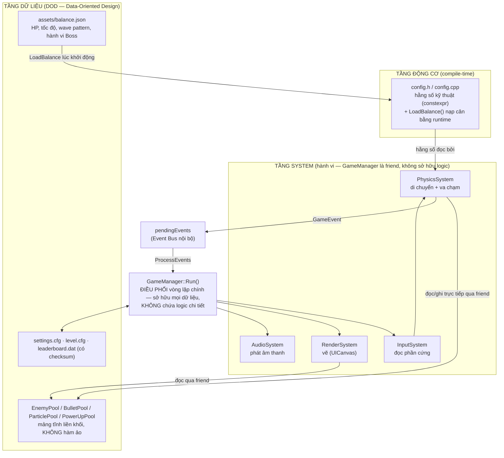
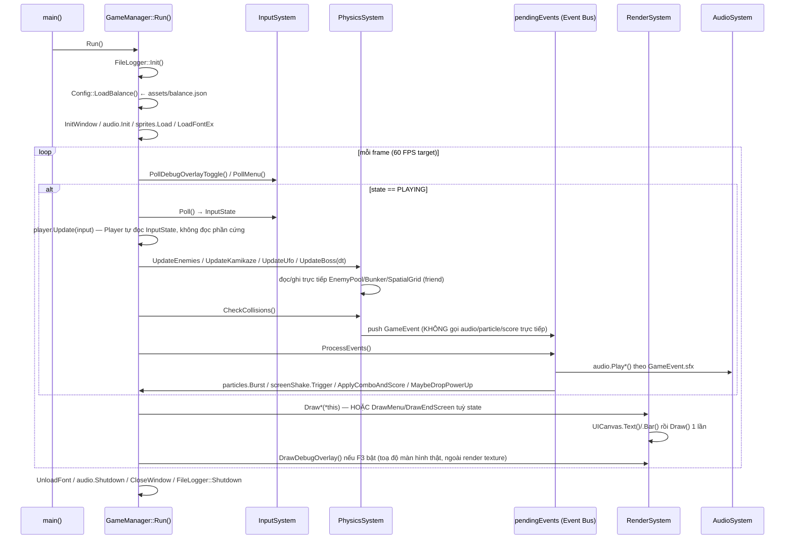
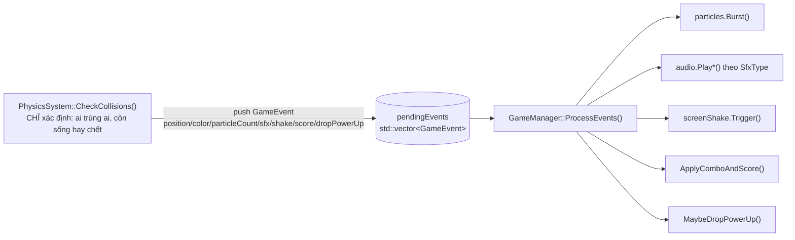

# Kiến trúc kỹ thuật — Hardcore Space Invaders

Tài liệu này là **bản đồ** cho bất kỳ ai (kể cả chính bạn 6 tháng sau) cần biết
"sửa cái này thì phải đụng vào đâu" mà không phải đọc lại toàn bộ `src/`. Nó mô
tả các module giao tiếp với nhau **thế nào**, không lặp lại **tại sao** từng
dòng code được viết như vậy — lý do chi tiết nằm trong comment tại chỗ.

> Sơ đồ dùng cú pháp [Mermaid](https://mermaid.js.org/) — GitHub render trực
> tiếp trong trình xem file, không cần công cụ ngoài.

## 1. Tổng quan 3 tầng

**Nguyên tắc phân tầng:** tầng dưới không bao giờ biết tầng trên tồn tại.
`Pools` không biết `PhysicsSystem`; `config.h` không biết `GameManager`.
Ngược lại thì có — `PhysicsSystem`/`RenderSystem` là `friend class` của
`GameManager` (xem `game_manager.h`) nên đọc/ghi thẳng dữ liệu thế giới mà
không cần một lớp getter/setter dày cộp chỉ tồn tại để "đúng OOP hình thức".

## 2. Vì sao DOD, không phải EnTT/ECS "thật"

Dự án **cố tình chọn DOD (Data-Oriented Design) thủ công thay vì nhúng một thư
viện ECS như EnTT.** Đây là quyết định có chủ đích, không phải làm biếng — lý
do:

- Quy mô game (vài loại địch, 1 Player, 1 Boss) không cần Entity ID động,
  Component Registry, hay View/Group query như EnTT giải quyết cho hàng vạn
  entity dị dạng. Nhúng EnTT vào đây là dùng dao mổ trâu giết gà — thêm 1 tầng
  gián tiếp (registry lookup, type-erased storage) mà không đổi lấy được lợi
  ích thực (không có nhu cầu tạo/xoá entity với component-set thay đổi động).
- Rewrite toàn bộ entity storage sang EnTT là thay đổi kiến trúc lớn, rủi ro
  cao cho một dự án nhỏ đã được tối ưu kỹ theo hướng khác — vi phạm chính
  nguyên tắc "tối ưu từ lúc project còn nhỏ, không được sai vặt" đã theo xuyên
  suốt các phase trước.

**Quy tắc DOD ĐANG được tuân thủ nghiêm ngặt** (không phải khẩu hiệu suông):

| Quy tắc | Thực thi ở đâu |
|---|---|
| Không có `virtual`/vtable ở bất kỳ đâu trong hot path | Toàn bộ `enemy_types.h`, `bullet_pool.h`, `particle_pool.h` |
| Component "swarm" (N-nhiều thực thể đồng dạng) là **struct dữ liệu thuần**, không mang hành vi | `BasicEnemy`/`TankyEnemy`/`ZigzagEnemy`/`KamikazeEnemy`/`Boss` — **không** có hàm `Update()` nào (xem §4) |
| System (không phải instance) sở hữu vòng lặp đọc/ghi component | `PhysicsSystem::UpdateEnemies/UpdateKamikaze/UpdateBoss/CheckCollisions` là nơi DUY NHẤT thay đổi dữ liệu Enemy mỗi frame |
| Mảng tĩnh liền khối, cấp phát 1 lần | `EnemyPool<T, Capacity>` dùng `T items[Capacity]` trên stack — không `std::vector<unique_ptr<T>>`, không phân mảnh heap |
| Xoá phần tử O(1), không để lại "xác chết" | Swap-and-pop (`EnemyPool::Destroy`) — biên `[0, count)` LÀ định nghĩa duy nhất của "còn sống", không có cờ `active` |
| Truy vấn không gian tránh O(N×M) | `SpatialGrid` — mỗi loại địch 1 grid riêng, value là index thuần vào đúng pool |

**Ngoại lệ có chủ đích** (không vi phạm nguyên tắc, chỉ khác phạm vi áp dụng):
`Bullet`/`Particle`/`Bunker`/`Player` vẫn giữ vài hàm thành viên non-virtual
(`Update()`, `GetSweptRect()`...) vì đây là **container/singleton tự quản lý
bất biến nội bộ** (vd `Bullet` cần `prevPos` để tính CCD, `Bunker` cần mảng
`damagedVoxels` luôn khớp với voxel grid) — không phải "component swarm" mà
System lặp qua hàng loạt bản sao dị dạng. Hàm non-virtual, không có heap
indirection, compiler inline được ở `-O2` — hiệu năng tương đương DOD thuần,
chỉ khác ở chỗ tổ chức code cho dễ đọc. Ranh giới rõ ràng: **nếu 1 kiểu dữ
liệu sống trong `EnemyPool<T,N>` và bị `PhysicsSystem` lặp qua mỗi frame, nó
phải là struct thuần — không có ngoại lệ.**

## 3. Vòng lặp chính (Main Loop) — `GameManager::Run()`

**Điểm mấu chốt:** `GameManager::UpdatePlaying()` (thân vòng lặp lúc PLAYING)
chỉ còn là **một chuỗi lời gọi tuần tự** — không phép tính hình học, không phép
so va chạm, không lệnh vẽ nào nằm trực tiếp trong đó. Đọc hàm này là đọc được
toàn bộ "chuyện gì xảy ra mỗi frame" ở mức cao, còn "xảy ra NHƯ THẾ NÀO" thì
lần theo tên hàm sang đúng System tương ứng.

## 4. Event Bus (`pendingEvents` / `GameEvent`)

Đây là cơ chế giao tiếp **PhysicsSystem → phần còn lại của game** — thay vì
`CheckCollisions()` gọi thẳng `audio.PlayExplosion()`/`particles.Burst()`/
`ApplyComboAndScore()` ngay tại chỗ phát hiện va chạm (trộn "phát hiện" với
"phản ứng" vào cùng 1 hàm khổng lồ), nó chỉ **mô tả chuyện gì vừa xảy ra**
bằng 1 `GameEvent` rồi đẩy vào hàng đợi `GameManager::pendingEvents`
(`events.h`). `GameManager::ProcessEvents()` — chạy NGAY SAU TRONG CÙNG FRAME
— duyệt hàng đợi và thực thi mọi hệ quả (âm thanh, particle, rung màn hình,
điểm, rớt power-up) một cách đồng nhất.

**Vì sao KHÔNG dùng hàng đợi đa-frame (deferred sang frame sau)?** Cố ý —
`pendingEvents` bị `.clear()` ở đầu `CheckCollisions()` và được xử lý sạch
ngay trong `ProcessEvents()` cùng frame đó. Đây không phải một message bus
tổng quát (publish/subscribe với nhiều listener đăng ký động) — nó là 1 buffer
tái sử dụng (tránh cấp phát lại `std::vector` mỗi frame) để **tách bạch 2 mối
quan tâm** (phát hiện vs phản ứng) mà vẫn giữ độ trễ bằng 0. Nếu sau này cần
hệ quả xuyên-frame thật sự (vd hiệu ứng trì hoãn 2 giây), đó là lúc cân nhắc
nâng cấp thành hàng đợi có timestamp — chưa cần ở quy mô hiện tại.

## 5. Bản đồ module

| File | Vai trò | Không nên làm gì |
|---|---|---|
| `game_manager.h/.cpp` | Sở hữu TOÀN BỘ dữ liệu thế giới (pools, player, bunkers...) + điều phối vòng lặp chính, wave progression, transition state | Không thêm phép tính va chạm/hình học/vẽ trực tiếp vào đây — đẩy sang System tương ứng |
| `input_system.h` | Nơi DUY NHẤT gọi `IsKeyDown/IsKeyPressed/IsGamepad*` | Không đọc phần cứng ở bất kỳ file nào khác |
| `physics_system.h/.cpp` | Di chuyển entity + va chạm; sinh `GameEvent`, KHÔNG tự gọi audio/particle | Không gọi `AudioSystem`/`ParticlePool` trực tiếp — luôn qua `GameEvent` |
| `render_system.h/.cpp` | Vẽ mọi màn hình qua `UICanvas`; hàm `const`, chỉ đọc | Không sửa bất kỳ field nào của `GameManager` |
| `audio_system.h/.cpp` | Tổng hợp & phát âm thanh procedural (không file `.wav`) | — |
| `ui_system.h` | `UICanvas`/`UIText`/`UIBar` — widget chế độ immediate | Không gọi `DrawTextEx` rải rác ngoài file này |
| `events.h` | Định nghĩa `GameEvent`/`SfxType` — "hợp đồng" giữa PhysicsSystem và ProcessEvents | — |
| `enemy_types.h` | Struct dữ liệu thuần cho từng loại địch + `EnemyPool<T,N>` | Không thêm hàm `Update()`/hành vi vào các struct Enemy (xem §2) |
| `bullet_pool.h` | `Bullet` (CCD qua swept rect) + `BulletPool<N>` | — |
| `spatial_grid.h` | Lưới không gian broad-phase cho va chạm | — |
| `bunker.h/.cpp` | Voxel-grid bunker: khoét/hồi phục O(1) qua `damagedVoxels` | — |
| `config.h/.cpp` | Hằng số kỹ thuật (`constexpr`) + biến cân bằng (`inline`, ghi đè runtime) | Không thêm hằng số CÂN BẰNG mới dạng `constexpr` — phải `inline` + có mặt trong `LoadBalance()` (xem §6) |
| `save_checksum.h` | Checksum FNV-1a cho file save | — |
| `leaderboard.h/.cpp` | Top 10 điểm cao, có xác thực checksum | — |
| `file_logger.h/.cpp` | Hook `SetTraceLogCallback` → ghi mọi `TraceLog` ra file xoay vòng | — |
| `culling.h` | `Culling::IsVisible()` — bỏ lệnh vẽ cho thực thể ngoài camera | — |
| `process_metrics.h` | Đọc RAM (RSS) thật từ `/proc/self/status` | — |

## 6. Data-Driven: ranh giới `constexpr` vs `inline`

`config.h` chia rõ 2 nhóm — xem comment đầu file để có định nghĩa đầy đủ:

- **`constexpr`** — hằng số KỸ THUẬT/ĐỘNG CƠ: kích thước màn hình, dung lượng
  tối đa của các pool tĩnh (`MAX_BASIC_ENEMIES`...), đường dẫn file. Những giá
  trị này **bắt buộc** biết tại compile-time (dùng làm template non-type
  param / kích thước `std::array`) hoặc là giới hạn AN TOÀN bộ nhớ, không
  phải thứ designer muốn "tune".
- **`inline`** (không `const`) — DỮ LIỆU CÂN BẰNG: HP, tốc độ, wave pattern,
  hành vi Boss, độ khó, power-up, combo, bunker regen... Giá trị khai báo
  trong `config.h`/`enemy_types.h` chỉ là **mặc định dự phòng** — bị
  `Config::LoadBalance()` (`config.cpp`, dùng `nlohmann::json`) ghi đè lúc
  khởi động từ `assets/balance.json`. Field nào JSON không nhắc tới thì giữ
  nguyên mặc định — không lỗi, không crash (cùng triết lý với
  `settings.cfg`/`level.cfg`).

Designer chỉnh cân bằng bằng cách sửa `assets/balance.json` rồi khởi động lại
game — **không cần chạm code C++, không cần build lại**. Muốn thêm 1 hằng số
cân bằng mới: khai báo `inline` trong `config.h` (hoặc `static inline` nếu
thuộc 1 struct Enemy cụ thể), rồi thêm 1 dòng `Assign(...)` tương ứng trong
`config.cpp` — 2 chỗ, không hơn.

## 7. Kiểm thử & CI

- `tests/` — Catch2 (vendor sẵn, không cần mạng lúc build) — test các khối
  logic THUẦN không cần cửa sổ/GPU: swept-AABB CCD (`test_bullet_ccd.cpp`),
  `SpatialGrid` (`test_spatial_grid.cpp`), `Leaderboard` + checksum
  (`test_leaderboard.cpp`), `Config::LoadBalance` (`test_balance_config.cpp`).
- `.github/workflows/ci.yml` — build raylib từ source, build project, chạy
  `ctest`. Bật thêm **Branch Protection Rule** (Settings → Branches, yêu cầu
  status check `build-and-test`) để thật sự chặn merge khi test đỏ — phần đó
  nằm ở cấu hình repo, không set được từ code.

## 8. Khi cần thêm 1 loại địch mới — checklist nhanh

1. Struct dữ liệu thuần trong `enemy_types.h` (không hàm hành vi).
2. `EnemyPool<NewEnemy, N>` + `SpatialGrid` riêng trong `game_manager.h`
   (`friend`-accessible bởi Physics/RenderSystem).
3. Hàm `PhysicsSystem::UpdateNewEnemy(GameManager&, float dt)` — di chuyển +
   spawn logic.
4. Khối xử lý va chạm tương ứng trong `PhysicsSystem::CheckCollisions()` — nếu
   địch mới "1 máu, chết ngay khi trúng" (như Basic/Zigzag/Kamikaze), gọi thẳng
   `ResolveOneHitKillCollision(...)` (định nghĩa đầu `physics_system.cpp`) thay
   vì viết tay lại vòng lặp; chỉ viết khối riêng nếu có state phức tạp hơn kiểu
   Tanky (nhiều máu, có nhánh "trúng nhưng chưa chết") hoặc Boss (thực thể toàn
   cục, không nằm trong pool). Dù theo cách nào, vẫn không gọi audio/particle
   trực tiếp — chỉ push `GameEvent`.
5. Vòng vẽ + `Culling::IsVisible()` trong `RenderSystem::DrawPlaying()`.
6. Hằng số cân bằng: `inline` trong `config.h`/struct + dòng `Assign()` trong
   `config.cpp` + field tương ứng trong `assets/balance.json`.
